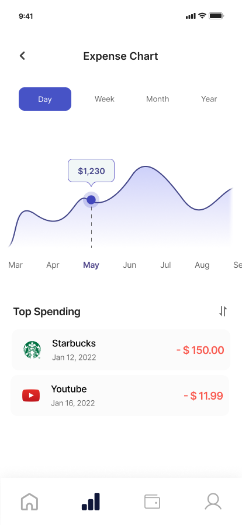
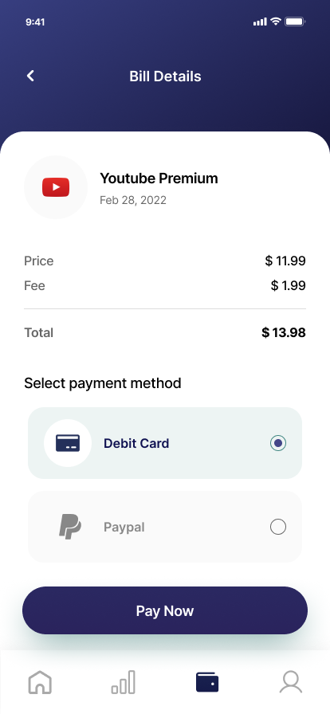
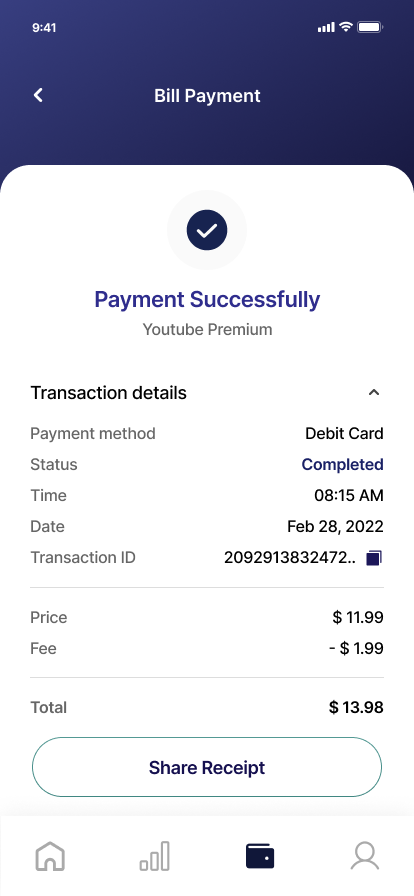
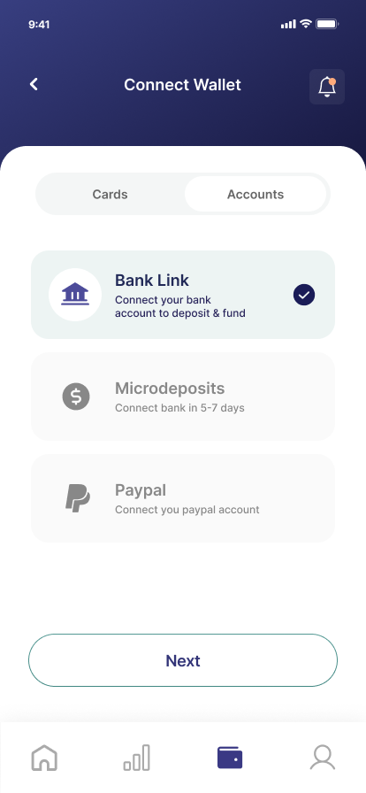
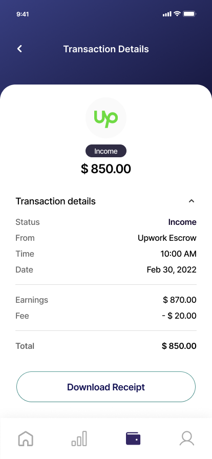
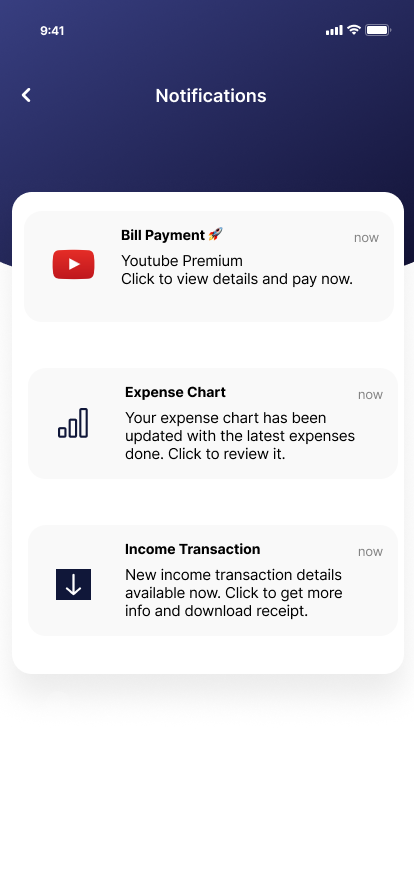
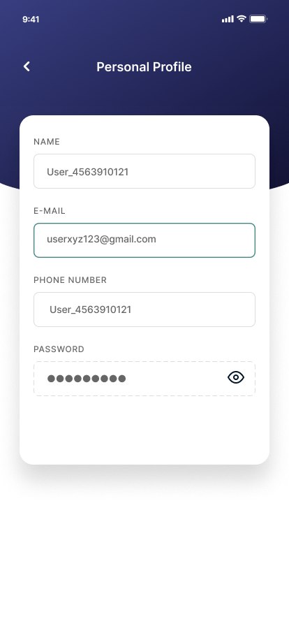
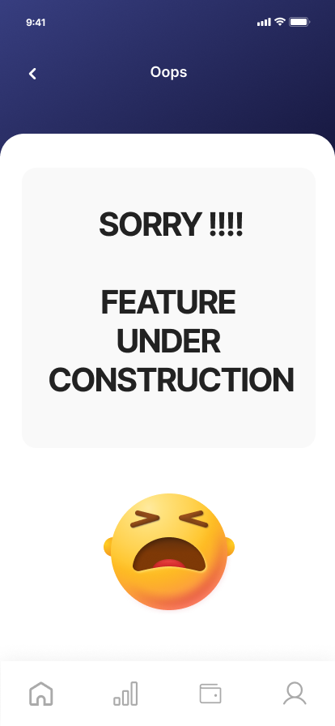

# Budget Master UI/UX Design

Welcome to the Budget Master UI/UX design project! This project showcases the user interface and user experience design for the Budget Master app, a user-friendly budgeting application.

## Overview

Budget Master is designed to help users take control of their finances effortlessly. The UI/UX design focuses on creating a seamless and intuitive experience for managing budgets, tracking expenses, and visualizing financial data.

## Features

- **Custom Budget Categories:** Create personalized budget categories to suit your financial goals.
- **Expense Tracking:** Easily track your expenses and analyze spending patterns.
- **Budget Visualization:** Visualize your budget with charts and graphs for better understanding.
- **Budget Goals:** Set and track budget goals to achieve financial milestones.
- **Secure and Private:** Ensures the security and privacy of financial data.

## Design Details

The design uses a clean and modern interface with a focus on user-friendly interactions. It includes:

- **Color Palette:** Utilizes a soothing color scheme to create a sense of financial calmness and control.
- **Typography:** Employs clear and readable fonts for better readability and accessibility.
- **Icons:** Uses intuitive icons to enhance user understanding and navigation.

## Screenshots

## How to View

To view the complete UI/UX design and interact with the prototype, you can access the Figma file [here](https://www.figma.com/file/Drjb3v8aA2yM2HpRjCWnkg/Budget-Master-UI?type=design&node-id=0%3A1&mode=design&t=F35WUJwcEL4Pd2Z1-1).

## Feedback

Your feedback is valuable! If you have any suggestions or ideas for improving the design, please feel free to reach out.

## License

This project is for demonstration purposes only and is not intended for commercial use.

